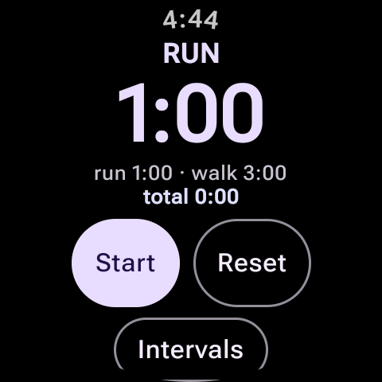
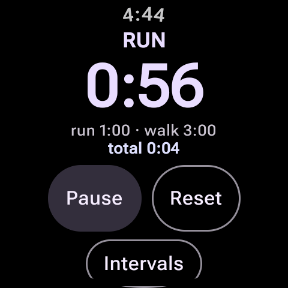
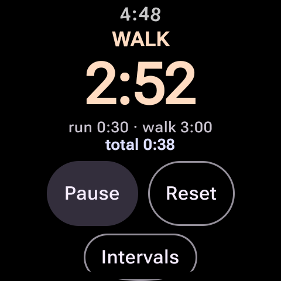
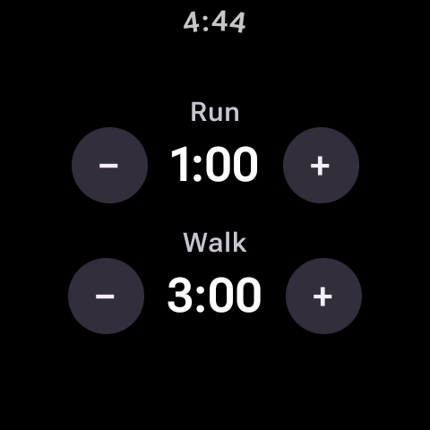

# MyRun

A minimal run/walk interval timer for Wear OS (built and tested on a Samsung Galaxy Watch6).

It alternates between two configurable intervals — e.g. **run 1:00**, then **walk 3:00** — buzzing the wrist and switching the display each time a phase ends. The timer keeps ticking with the screen off (foreground service + wake lock) and shows a low-power face in ambient mode.

## Screenshots

<table>
  <tr>
    <td align="center"><br><sub><b>Ready</b> — RUN phase queued at 1:00</sub></td>
    <td align="center"><br><sub><b>Running</b> — countdown with total elapsed time</sub></td>
  </tr>
  <tr>
    <td align="center"><br><sub><b>Walk phase</b> — colour changes with the phase</sub></td>
    <td align="center"><br><sub><b>Intervals</b> — adjust run / walk in 30 s steps</sub></td>
  </tr>
</table>

## Features

- Two alternating phases (RUN / WALK) with independent durations
- Vibration on every phase change
- Start / Pause / Reset, plus total elapsed time
- Interval lengths adjustable on the watch (±30 s) and persisted across restarts
- Keeps running with the screen off via a foreground service
- Dedicated ambient-mode face (black background, dim text, burn-in drift)

## Using it

1. Tap **Intervals** and set the run and walk durations with **−** / **+**.
2. Swipe right to go back, then tap **Start**.
3. The watch buzzes and the display flips between **RUN** and **WALK** at the end of each interval.
4. **Pause** to hold, **Reset** to return to the start of a RUN phase with total time cleared.

## Building

Requires Android Studio with the Wear OS SDK (minSdk 30).

```sh
./gradlew assembleDebug
adb -s <watch-serial> install -r app/build/outputs/apk/debug/app-debug.apk
```

## Project layout

| File | Purpose |
| --- | --- |
| `app/src/main/java/com/sient/myrun/presentation/MainActivity.kt` | Compose UI: timer screen, settings screen, ambient face |
| `app/src/main/java/com/sient/myrun/presentation/TimerEngine.kt` | Timer state, phase switching, vibration, persistence |
| `app/src/main/java/com/sient/myrun/presentation/TimerService.kt` | Foreground service + wake lock so the timer survives screen-off |
| `app/src/main/java/com/sient/myrun/presentation/theme/Theme.kt` | Material 3 theme for Wear |
